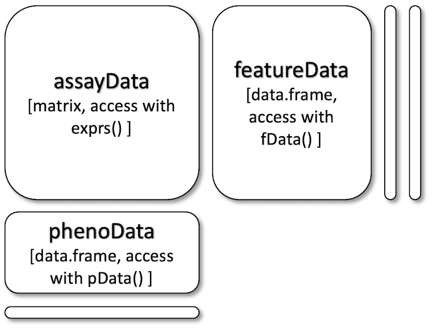

```{r setup, include = FALSE}
knitr::opts_chunk$set(
  collapse = TRUE,
  comment = "#>"
)
```

```{r, message=FALSE}
library(MSnbase)
library(camprotR)
library(dplyr)
```

## Introduction

**What is an MSnSet?** To quote from `MSnbase`:

> The `MSnSet` class is derived form the `Biobase::eSet` class and mimics the
`Biobase::ExpressionSet` class classically used for microarray data.

This function description is a bit dense and unintelligible to the uninitiated. 
Additionally, there is already a 
[vignette](https://bioconductor.org/packages/release/bioc/vignettes/MSnbase/inst/doc/v02-MSnbase-io.html) 
in the `MSnbase` package describing MSnSets, but this may be a bit hard to
understand for beginners.

Here, I will describe an MSnSet in my own words.

> An MSnSet is a special type of list (specifically it is an S4 object) that 
contains information about an MS experiment. 

To better understand MSnSets we first need to define some terminology.
In a quantitative proteomics experiment we are analysing 'samples' from
different experimental conditions via MS, e.g. comparing 'samples' from cells 
treated with a drug versus a control. The quantitative data we eventually
obtain consists of measurements of 'features'. In this context, features can be 
PSMs, peptides, or proteins.

**MSnSets contain multiple objects of different types:**

- The quantitative data ('assay data'; in a `numeric matrix`)
- The associated 'feature data' for each row in the quantification data 
(in a `Biobase::AnnotatedDataFrame`)
- Metadata describing the MS experiment, for each column in the quantification 
data ('phenotype Data'; in a `Biobase::AnnotatedDataFrame`)
  
**These underlying objects must have a specific structure:**

- The number of _rows_ in `assayData` must match the number of _rows_ in 
`featureData` and the row names must match exactly.
- The number of _columns_ in `assayData` must match the number of _rows_ in
`phenoData` and the column/row names must match exactly.

```{r, echo=FALSE, out.width='60%', fig.cap=msnset_cap}
msnset_cap <- "Dimension requirements for the assayData (aka. expression data), 
featureData and phenoData (aka. sample data), slots. Adapted from 
[this MSnbase vignette](https://www.bioconductor.org/packages/release/bioc/vignettes/MSnbase/inst/doc/v02-MSnbase-io.html)."

```

Conveniently, the `MSnbase` package comes with some example MSnSets. In this
vignette we will explore the `msnset` MSnSet. This data set is from an 
iTRAQ 4-plex experiment wherein BSA and Enolase have been spiked into a background
of _Erwinia_ proteins. See `?msnset` for more information.

## Exploring an MSnSet

My favourite way to have a look at anything in R is to use the `str()` 
function to explore an objects' structure. Here we look at `msnset` 
which is an MSnSet with 9 'slots' that each contain some sort of object.

```{r}
str(msnset, max.level = 2)
```

Each slot in `msnset` is described in detail in the **'MSnSet slots'** section 
below. For now we will only concern ourselves with the `assayData`, 
`featureData`,  and `phenoData` slots. 

### assayData

The `assayData` slot contains the quantitative data from the experiment, 
i.e. how much of each feature (spectra/PSM, peptide, or protein) was detected 
in each sample. **This is the essential part of an MSnSet.** All other slots 
are optional.

We can extract this information from the MSnSet into a numeric matrix with the 
`exprs()` function.

```{r}
msnset_exprs <- exprs(msnset)
```

Lets look at its structure.

```{r}
str(msnset_exprs)
```

It is an `r nrow(msnset_exprs)` by `r ncol(msnset_exprs)` numeric matrix. 
The data it contains is reporter ion intensities from `r ncol(msnset_exprs)` 
iTRAQ tags across `r nrow(msnset_exprs)` different PSMs.

Each **column** of this matrix refers to an iTRAQ tag which corresponds
to an individual **'sample'**. Each **row** of this matrix corresponds to a 
**'feature'** which in this case is a PSM. The numbers indicate the intensity of
the reporter ion from a particular tag (i.e. sample) in a particular PSM.

### featureData

The `featureData` slot contains metadata about the 'features' (e.g. PSMs, 
peptides, proteins). 

We can extract this information from the MSnSet into a data.frame with the 
`fData()` function.

```{r}
msnset_fdata <- fData(msnset)
```

Lets look at its structure.

```{r}
str(msnset_fdata)
```

It is a `r nrow(msnset_exprs)` by `r ncol(msnset_exprs)` data.frame. The data
it contains is metadata about each 'feature', which are PSMs in this case. 
The type of metadata included is entirely arbitrary and there can be as many
or as few columns as you want.

Each **column** of this matrix refers to a particular type of metadata. 
Each **row** of this matrix corresponds to a **'feature'** which in this case 
is a PSM. Thus, the number of rows in `featureData` is the same as
the number of rows in `assayData`. Also note that the row names of
`featureData` exactly match the row names of `assayData`.

```{r}
rownames(exprs(msnset)) == rownames(fData(msnset))
```

### phenoData

The `phenoData` slot contains metadata about the 'samples'.

We can extract this information from the MSnSet into a data.frame with the 
`pData()` function.

```{r}
msnset_pdata <- pData(msnset)
```

Let's look at its structure.

```{r}
str(msnset_pdata)
```

It is a `r nrow(msnset_exprs)` by `r ncol(msnset_exprs)` data.frame. The data
it contains is metadata about each 'sample', which are iTRAQ tags in this case. 
The type of metadata included is entirely arbitrary and there can be as many
or as few columns as you want.

Each **column** of this matrix refers to a particular type of metadata. 
Each **row** of this matrix corresponds to a **'sample'** which in this case 
is an iTRAQ tag. Thus, the number of rows in `phenoData` is the 
same as the number of columns in `assayData`. Also note that the row names of
`phenoData` exactly match the column names of `assayData`.

```{r}
colnames(exprs(msnset)) == rownames(pData(msnset))
```

## Making an MSnSet

In the previous section we explored an small example MSnSet supplied with 
`MSnbase`. Here we will construct our own MSnSet. A small `PSMs.txt` 
Proteome Discoverer (PD) table from a TMT 10-plex 
experiment is provided with the `camprotR` package which we will turn into an MSnSet.

### The input data

Lets have a look at our PSM data from PD. It is a data.frame.

```{r}
str(psm_tmt_total)
```

This data.frame contains `r nrow(psm_tmt_total)` PSMs. We have 
quantitative data for each PSM (the `Abundance` columns) and metadata for each 
PSM (all the other columns).

### assayData

As before, the single essential part of an MSnSet is the `assayData` slot which
contains the quantitative data from your experiment. 

In this case, it should contain a numeric matrix with `r nrow(psm_tmt_total)` 
rows corresponding to the `r nrow(psm_tmt_total)` PSMs and 
`r sum(grepl("Abundance\\.", colnames(psm_tmt_total)))` columns corresponding 
to the `r sum(grepl("Abundance\\.", colnames(psm_tmt_total)))` TMT tags.

First we extract the columns with the quantitative data and convert them to a
numeric matrix.

```{r}
# abundance columns for TMT PD output start with Abundance 
abundance_cols <- colnames(psm_tmt_total)[grepl('Abundance.', colnames(psm_tmt_total))]

tmt_exprs <- as.matrix(psm_tmt_total[, abundance_cols])
```

Then we remove the word 'Abundance' from the column names to make them more 
concise.

```{r}
# update the column names to remove the 'Abundance.` prefix
colnames(tmt_exprs) <- gsub('Abundance.', '', colnames(tmt_exprs))
```

Lastly, we use the unique `PSMs.Peptide.ID` column to define unique row names. 
This is important for extracting and combining data down the line. Row names
must be unique!

```{r}
# use PSMs.Peptide.ID, which are unique, to define rownames
rownames(tmt_exprs) <- psm_tmt_total$PSMs.Peptide.ID
```

Our quantitative data are now ready.

### featureData

Now we construct a data.frame with metadata for each PSM to go into the 
`featureData` slot of our MSnSet.

In this case, it should be a data.frame with `r nrow(psm_tmt_total)` rows 
corresponding to the `r nrow(psm_tmt_total)` PSMs and any number of columns.

First we extract the columns with the metadata of interest. Here we want 
everything but the `Abundance` columns and the unique IDs.

```{r}
# get all columns except Abundance columns identified earlier
metadata_cols <- setdiff(colnames(psm_tmt_total), c(abundance_cols, "PSMs.Peptide.ID"))

tmt_fdata <- psm_tmt_total[, metadata_cols]
```

Again, we use the unique `PSMs.Peptide.ID` column to define unique row names. 
**This must match `tmt_exprs`!**

```{r}
# use PSMs.Peptide.ID, which are unique, to define rownames
rownames(tmt_fdata) <- psm_tmt_total$PSMs.Peptide.ID
```

Our metadata are now ready.

### phenoData

Lastly, we construct a data.frame with metadata for each TMT 10-plex tag, to
go into the `phenoData` slot of our MSnSet.

In this case, it should be a data.frame with `r ncol(tmt_exprs)` rows corresponding
to the `r ncol(tmt_exprs)` TMT tag and any number of columns.

First we construct an empty data.frame with `r ncol(tmt_exprs)` rows.

```{r}
tmt_pdata <- data.frame(matrix(nrow = 10, ncol = 0))
```

Then we can add some metadata. In this example we will just add some fake sample
names and fake treatment conditions.

```{r}
tmt_pdata$sample <- paste0("sample", 1:10)
tmt_pdata$treatment <- rep(c("trt", "ctrl"), each = 5)
```

The rownames must be identical to the column names of `tmt_exprs`.

```{r}
rownames(tmt_pdata) <- colnames(tmt_exprs)
```

### Make the MSnSet

Now we construct the MSnSet. As long as we have set up the underlying data 
properly, this step is the easiest!

```{r}
tmt_msnset <- MSnSet(exprs = tmt_exprs, fData = tmt_fdata, pData = tmt_pdata)
```

Lets have a look at its structure.

```{r}
str(tmt_msnset, max.level = 2)
```

As before we can access the different slots as follows.

```{r}
# access the quantitative data
head(exprs(tmt_msnset))

# access the PSM metadata
head(fData(tmt_msnset))

# access the sample metadata
head(pData(tmt_msnset))
```

## Extracting results from an MSnSet

The code below shows briefly how to save/export the data within an MSnSet.

Using `write.exprs()` from `MSnbase` is the easiest way. Use the fDataCols
argument to specify which `featureData` columns to add to the right of the
quantitative data (specify as column names, column numbers, or a logical vector).
The other arguments are the same as `write.table()`.

```{r, eval=FALSE}
MSnbase::write.exprs(
  tmt_msnset, 
  file = "results.csv",
  fDataCols = c("Percolator.q.Value", "Master.Protein.Accessions"),
  sep = ",", row.names = FALSE, col.names = TRUE
)
```

Alternatively you can manually combine the results manually.

```{r}
results <- merge(
  exprs(tmt_msnset), # extract PSM quantitative data
  fData(tmt_msnset), # extract PSM metadata
  by = 0 # join by rownames
)
```

And then use the `writexl` package to save to Excel.

```{r, eval=FALSE}
writexl::write_xlsx(results, path = "results.xlsx")
```

## MSnSet slots

This section contains a detailed description of each MSnSet slot.

### assayData

Contains the quantitative data from the experiment, i.e. how much of each
feature (e.g. PSM, peptide, protein) was detected in each sample. This is the 
essential part of an MSnSet.

* Access with `exprs(MSnSet)`
* Object = a matrix of expression values, access the dimensions with 
  `dim(MSnSet)`
  * row names = feature names (e.g. PSMs, peptides, proteins), must be 
    unique (e.g. UniProt accessions in protein groups like `Q12345;Q98765`),
    access with `featureNames(MSnSet)`
  * column names = sample names, must be unique, access with `sampleNames(MSnSet)`
  * data = expression values e.g. SILAC ratios, peptide intensities, etc.
  
### featureData

Optional. Contains metadata about the features (e.g. proteins, peptides, PSMs). 
For example for protein features this object might contain the protein names, 
their lengths, isoelectric points, number of transmembrane domains, associated
GO terms, etc.

* Access the overall object with `featureData(MSnSet)`
* Access the underlying data.frames with `fData(MSnSet)` 
  and `fvarMetadata(MSnSet)`.
* Object = a `Biobase::AnnotatedDataFrame`, which is comprised of 2 
data.frames
* data.frame 1 (fData)
  * row names = feature names (e.g. PSMs, peptides, proteins), names must be 
    unique (e.g. UniProt accessions in protein groups like `Q12345;Q98765`)
  * column names = short name of feature parameter e.g. `transmem`, access with
    `fvarLabels(MSnSet)`
  * data = can be numeric, character, factor, boolean
* data.frame 2 (varMetadata, optional)
  * row names = name of equipment-generated parameter e.g. `transmem`
  * column = a single column called `labelDescription`
  * data = character, full description/name of the equipment generated 
    parameters e.g. `Number of transmembrane domains`
    
### phenoData

Optional. Contains metadata about each sample, usually relating to the 
experimental design, e.g. replicates, tissues, animals, treatments, etc.
  
* Access the overall object with `phenoData(MSnSet)`
* Access the underlying data.frames with `pData(MSnSet)` 
  and `varMetadata(MSnSet)`.
* Object = a `Biobase::AnnotatedDataFrame`, which is comprised of 2 
data.frames. 
* data.frame 1 (pData)
  * row names = sample names, must be unique
  * column names = short name of sample metadata parameters e.g. `trt`, access
    with `MSnSet$`
  * data = can be numeric, character, factor, boolean
* data.frame 2 (varMetadata, optional)
  * row names = short name of sample metadata parameters e.g. `trt`
  * column = a single column called `labelDescription`
  * data = character, full description of sample metadata parameters
    `Drug treatment`
    
### protocolData

Optional. Contains equipment-generated information about the protocols used for 
each sample. The number of rows and the row names must match the number of 
columns and column names of `assayData`.

* Access the overall object with `protocolData(MSnSet)`
* Access the underlying data.frames with `pData(protocolData(MSnSet))` 
  and `varMetadata(protocolData(MSnSet))`.
* Object = a `Biobase::AnnotatedDataFrame`, which is comprised of 2 
data.frames
* data.frame 1 (pData)
  * row names = sample names, must be unique
  * column names = short name of equipment-generated parameter e.g. `ms_model`
  * data = can be numeric, character, factor, boolean
* data.frame 2 (varMetadata, optional)
  * row names = name of equipment-generated parameter e.g. `ms_model`
  * column = a single column called `labelDescription`
  * data = character, full description/name of the equipment generated 
    parameters e.g. `MS Model`

### experimentData

Optional. Contains descriptive information about the experiment and the 
experimenter.

* Access the overall object with `experimentData(MSnSet)`
* Object = a `Biobase::MIAME` object, which is essentially a list of several
  characters and lists.
  * _name_ = character, contains experimenter name, access with     
    `expinfo(MSnSet)`
  * _lab_ = character, lab where experiment was conducted, access with     
    `expinfo(MSnSet)`
  * _contact_ = character, contact info for experimenter and/or lab, access 
    with `expinfo(MSnSet)`
  * _url_ = character, URL for experiment, access with     
    `expinfo(MSnSet)`
  * _title_ = character, single-sentence experiment title, access with     
    `expinfo(MSnSet)`
  * _abstract_ = character, abstract describing the experiment, access with     
    `abstract(MSnSet)`
  * See `Biobase::MIAME` for info about other (probably unnecessary) sub-objects.

### processingData

Contains the version of MSnbase used to construct the MSnSet and
also a log of what processes have been applied to the MSnSet.

* Access the overall object with `processingData(MSnSet)`
* Object = an `MSnProcess` object, which contains several sub-objects that 
  can be accessed using `processingData(MSnSet)@`
  * _files_
  * _processing_
  * _merged_
  * _cleaned_
  * _removedPeaks_
  * _smoothed_
  * _trimmed_
  * _normalised_
  * _MSnbaseVersion_
